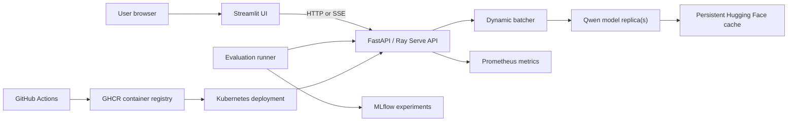

# System architecture

## Request path

1. Streamlit converts the user's controls into a validated JSON request.
2. FastAPI handles one local model, or Ray Serve routes requests to replicas.
3. Compatible concurrent requests may form a padded tensor batch.
4. Standard FastAPI can return Server-Sent Events while tokens are generated.
5. Prometheus measurements expose traffic, errors, latency, output, and batches.
6. The evaluation runner sends a fixed dataset and stores comparable MLflow runs.

## Deployment path

The frontend and model backend have different resource needs. Streamlit Community
Cloud can host the lightweight UI. The PyTorch/Qwen backend belongs on a container
host or Kubernetes cluster with sufficient memory and persistent model storage.
The UI's `LLM_API_URL` secret points to the backend's public HTTPS address.

GitHub Actions checks every change. A version tag builds an AMD64/ARM64 image and
publishes it to GitHub Container Registry (GHCR); Kubernetes then pulls that image.

## Honest production boundaries

This is a strong learning and portfolio system, not yet an internet-scale managed
service. Before exposing a paid backend publicly, add authentication, TLS, request
rate limits, abuse controls, centralized logs, vulnerability scanning, and a cloud
secret manager. Autoscaling must also account for expensive model startup and the
memory required by every replica.
